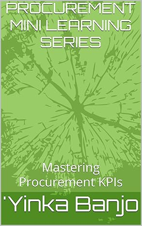
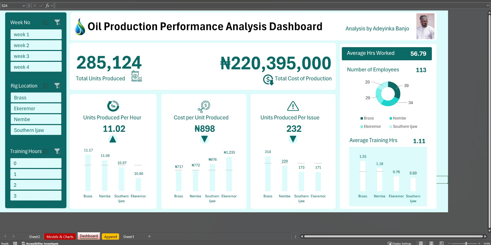
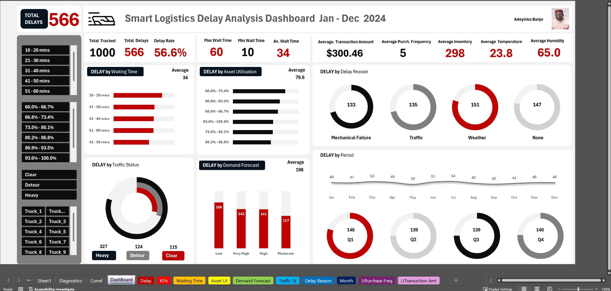
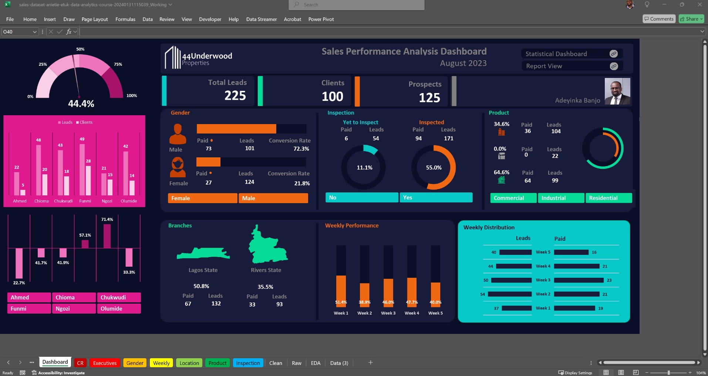
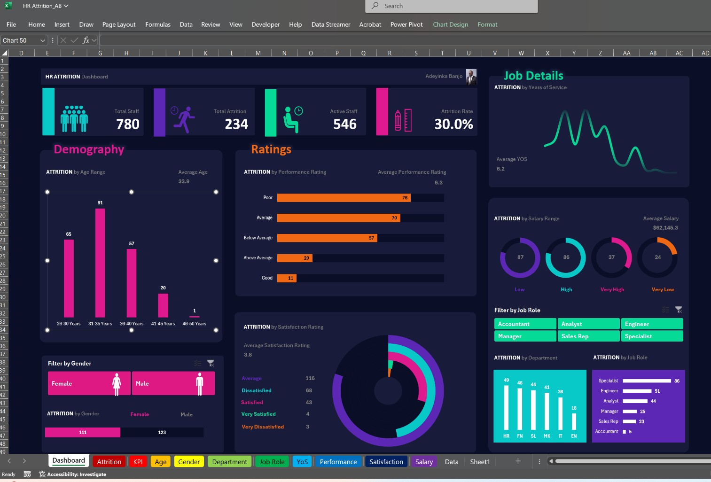
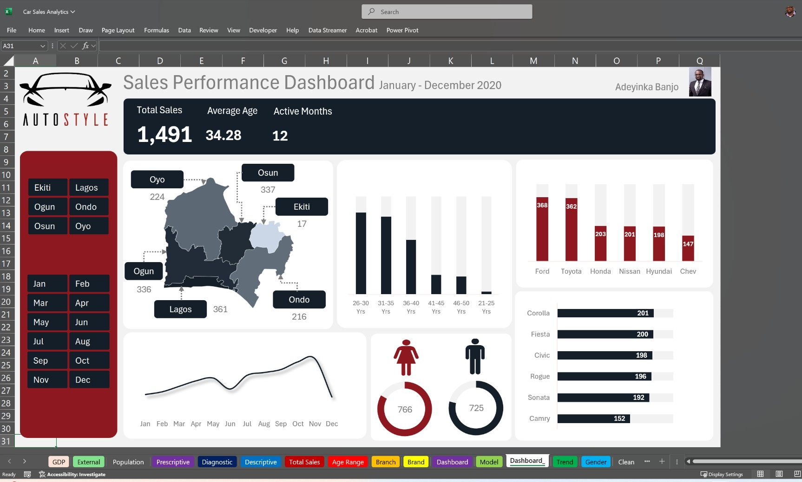

# Portfolio
Portfolio showcase of privately created analysis project dashboards, eBooks & sundry works without proprietary restrictions 

## ABOUT ME
Hi! I'm Adeyinka Banjo, a business leader and digitisation/improvement expert. I help improve bottom lines & grow businesses sustainably using data, technology & innovation. 
My industry practice spans energy (oil, gas, & power), manufacturing (FMCG), marine (& land) logistics, industrial printing and consulting. I am also an author and supply chain management (SCM) trainer across all core functions. 

## WHAT I DO
*As a director and board member with both Gognmine Energy Limited & StrateDelta Limited I provide my expertise in Supply Chain Management & Energy projects to prospect and consummate commercial deals for business execution.*

**- ✅ Business Digitisation & Data Analytics Consulting.**
Transform your business with data-driven insights for sustainable growth and improved profitability. I guide companies through a realistic digitization roadmap, starting from any point (even fully manual processes). I then unlock actionable insights through analysis, delivering tailored solutions to optimize your operations and fuel growth based on solid data.

**- ✅ Supply Chain Management Consulting.**
Achieve exceptional business performance through a smarter supply chain. I help you optimize the interplay between your people, processes, partnerships, and technology, ensuring solutions are perfectly matched to your company's development stage.

**- ✅ Organisation Staff Training & Development.**
I offer targeted training programs to develop crucial skills from beginner through advanced levels in:
*-Comprehensive Supply Chain Management**: Including planning, sourcing, manufacturing, logistics, warehousing, materials management & SCM technologies.*
*-Data Analysis & Visualization**: Turning data into actionable insights.*
*-Data-Driven Decision-Making**: Applying data effectively to drive business results.*

## MY PORTFOLIO

*A glimpse of some of the projects I've been working on and authored material.*

**PROCUREMENT MINI-LEARNING SERIES: Mastering Procurement KPIs.**

*Includes 5 Most commonly used KPIs, 15 bonus KPIs, —their definitions, explanations, calculation components and importance. 
Strategies for effective KPI management, how to choose the right KPIs, common pitfalls, & frequently asked questions (FAQs)
to help **IMPROVE** Procurement team performance.*

**Predictive Modeling and Hypothesis Testing using Oil Production Dataset.**

*Includes Location, Personnel & Production Performance Analysis to **IMPROVE** Production*

**Predictive Modeling and Hypothesis Testing using Logistics Dataset.**

*Includes 16-Parameter Performance Analysis to **REDUCE** Logistics Delay by service provider*

**Predictive Modeling and Hypothesis Testing using Real Estate Sales Dataset.**

*Includes Employee, Customer Gender, Location, Product-Type etc. Performance Analysis to **IMPROVE** company Sales*

**Predictive Modeling and Hypothesis Testing using HR Employee Dataset.**

*Includes Gender, Age Range, Salary Range, Years of Service, Performance Rating, Job Satisfaction Rating etc. Performance Analysis to **REDUCE** Employee Attrition*

**Predictive Modeling and Hypothesis Testing using Car Sales Dataset.**

*Includes Employee, Location, Customer Gender, Age Range, Car Make, Car Model etc. Performance Analysis to **IMPROVE** company Sales*

## CONTACT DETAILS
*Feel free to connect so we can collaborate to deliver value!*
<table>
<tbody>
<tr>
<td>􊷗􊷘􊷙􊷚􊷛􊷝􊷜</td>
<td><a
href="mailto:anietieetuk@gmail.com">anietieetuk@gmail.com</a></td>
</tr>
<tr>
<td>􊶭􊶮</td>
<td>(234) 816-763-7212</td>
</tr>
<tr>
<td>􊵗􊵙􊵘</td>
<td>PH, Nigeria</td>
</tr>
<tr>
<td>􈄥􎆻</td>
<td><a
href="https://etuk123456.github.io/portfolio1/docs/Profile.pdf">Download my
CV</a></td>
</tr>
<tr>
<td>􈈏</td>
<td><a href="https://linkedin.com/in/etukanietie">The things I do daily
on LinkedIn</a></td>
</tr>
<tr>
<td>􊸼􊸽􊸾􊹂􊸿􊹃􊹄􊹀􊹁</td>
<td><a href="https://www.youtube.com/@LearnwithEtuk">Watch my tutorials
on YouTube</a></td>
</tr>
</tbody>
</table>

